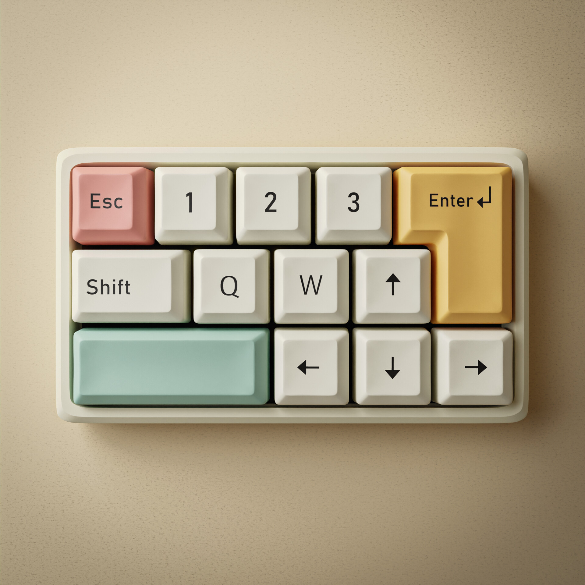

# 👋 Hello World, I’m Zakaria!

I'm currently a student at **1337 School Benguérir**. My passion lies in logic and mathematics, which is why I am deeply interested in programming, particularly in competitive programming and problem-solving.

## My Github Stats

  
  

## My LeetCode Profile

  
  

